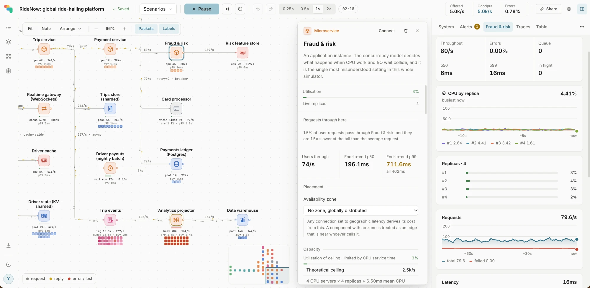
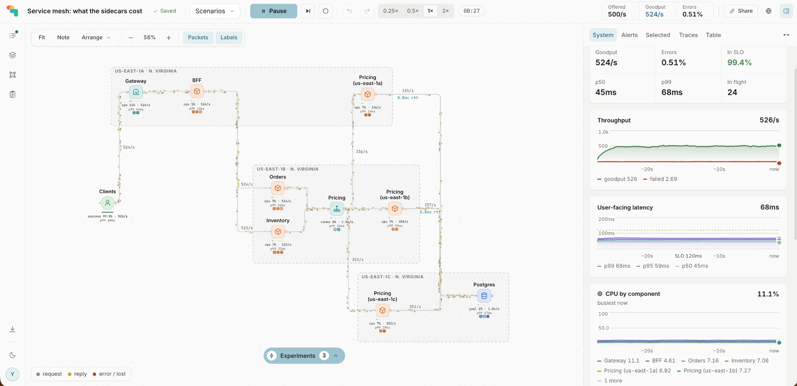
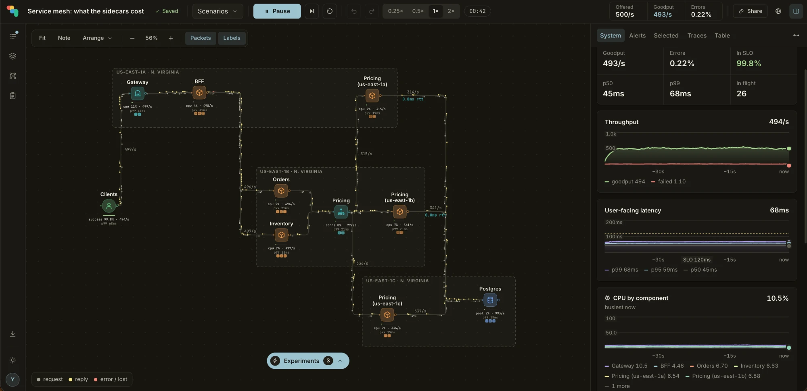

  

<h1 align="center">ShardPath</h1>

<b>Design a system. Put load on it. Watch where it breaks.</b>

  An interactive simulator for system design: draw your architecture, run real traffic through it, 
  and see throughput, latency and failures, component by component, as they happen.

---

## What it does

- **Design on a canvas.** Load balancers, services, caches, databases (replicas and shards), Kafka topics and consumers, CDNs, API gateways, third-party APIs and more, each with settings that behave like the real thing.
- **Simulate real traffic.** A discrete-event engine sends every request through your design. You see p50, p95 and p99 latency, errors, queueing, connection pools and utilisation live.
- **Break it on purpose.** Take down a database primary, slow a dependency, kill replicas, or lose an availability zone, then watch retries, circuit breakers and autoscaling respond.
- **Find the limit.** Discover how much load the design takes before it misses its SLO, and which component gives out first.
- **Learn from real incidents.** Replay well-known outages and design patterns step by step, with guided walkthroughs.
- **Work with your AI assistant.** An MCP server lets any MCP client (Claude, Cursor, VS Code, ChatGPT and others) build, simulate and review designs with you.

## Light and dark

---

  Built for engineers preparing for system design interviews, and for teams who want to see a design fail before production does.

